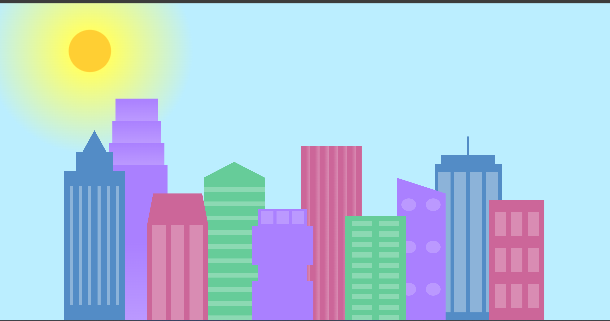
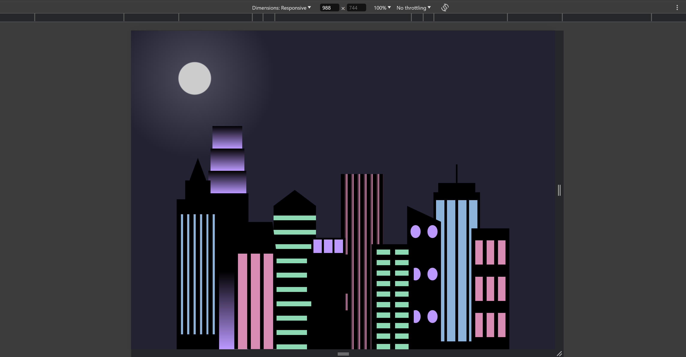

# City Skyline

City Skyline is a simple web project created using HTML and CSS. It renders a basic skyline scene with buildings and windows, offering a visually appealing view reminiscent of a cityscape.

## Table of Contents

- [Features](#features)
- [Demo](#demo)
- [Installation](#installation)
- [Usage](#usage)
- [Customization](#customization)
- [Contributing](#contributing)

## Features

- **Responsive Design:** The skyline adapts to different screen sizes, providing a consistent experience across devices.  
- **Dynamic Styling:** Customizable colors for buildings and windows, allowing for easy theme adjustments.  
- **Simple Structure:** Built using straightforward HTML and CSS, making it easy to understand and modify. 

## Demo

  

  

## Installation
    
<ul>
<li>    Clone this repository using Git: </li>

    git clone https://github.com/Yashi-Singh-1/City-Skyline.git 
    
Alternatively, download the ZIP file from the GitHub repository and extract it to your project directory.
</ul>

## Usage

To use City Skyline in your project, follow these steps:

1. Include the styles.css file in your HTML:

   <link href="styles.css" rel="stylesheet" />

2. Copy the HTML structure from index.html into your own HTML file.

3. Customize the colors and dimensions as needed.

4. Preview your page in a web browser to see the skyline rendered.

## Customization

City Skyline offers easy customization options through CSS variables. You can adjust the following variables in your CSS file to customize the appearance:

- --building-color1, --building-color2, --building-color3, --building-color4: Colors of the buildings.
- --window-color1, --window-color2, --window-color3, --window-color4: Colors of the windows.
   

For example, to change the color of the buildings, you can override the --building-color1 variable like this:  

:root {
  --building-color1: #ff0000; /* Red */
}

## Contributing

Contributions are welcome! If you find any issues or have suggestions for improvements, feel free to open an issue or create a pull request. Make sure to follow the.
